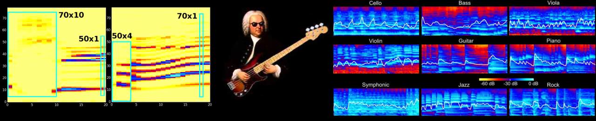

# Advanced Machine Learning Final Project

## HPC Setup

1. login to hpc
2. Git setup on HPC:
   1. copy public key to clipboard and go to github settings and create new ssh key
   Run `cat .ssh/id_rsa.pub` from inside home directory and copy output to clipboard
   2. Clone our repo
   `git clone git@github.com:syeon0928/Tagging-Music-Sequences.git`
   3. Update repo as usual (see below under Git commands)
3. `sbatch setup_conda_env` to setup environment (install packages etc)
4. `sbatch run_jupyter_notebook.sh` to run the jupyternotebook 
5. `cat jupyter-notebook-{your job number}.log` to show output of running script
6. copy ssh command from log file and run on another terminal ex) `ssh -N -L 8248:desktop2:8248 [seuh@hpc.itu.dk]`
7. open the URL from the log file (last link)

## Git commands

Process to update local repo:
1. Get updates from remote repo: `git fetch`
2. Merge remote into local repo: `git pull`

To update repo with local changes:
1. Stage your changes: `git add -A` or `git add specific_file` (if you only want to commit one file)
2. Commit your changes: `git commit -m 'INSERT COMMIT DESCRIPTION HERE`
3. Push to remote repo: `git push origin main` or simply `git push`

git fetch → pull / add file → commit -m “message” → git push
## Tagging music sequences.

Music plays an important role in our lives, while the landscape of contemporary music is vast. In order to understand music taste and build recommender systems for music, we need to learn to tag music first. In this project, we want to build a classifier that can tag music pieces with a genre or category after listening to an arbitrary long example. For this, we want to consider the following datsets:
- [GTZAN](https://www.kaggle.com/datasets/andradaolteanu/gtzan-dataset-music-genre-classification)
- [The MagnaTagATune Dataset (MTAT)](https://mirg.city.ac.uk/codeapps/the-magnatagatune-dataset), and
- for advanced studies: [the Free Music Archive (FMA)](http://freemusicarchive.org/).

### Main goals:

- Research literature about sound and music pre-processing, transformation, and representation. What type of pre-processing is best for music pieces, i.e. what is the state-of-the-art of spectrograms vs. raw waveform?
- Train an encoding model (deep recurrent and/or CNN network) with appropriate representation to classify sequences of music pieces. Your options are vast as you can consider all the tools that we covered in class: GRUs? CNNs? Variational Encoders? Combinations thereof? Make use of recent examples from literature! Can you identify an architecture (and meta-parameter settings) that can be trained to tag/classify considerably well?
- Study the performance for edge cases, such as particularly short input sequences or music pieces for rare genres/categories. Can you identify characteristics of such edge cases that make performance particularly high or low?
- Identify differences in quantitative performance and qualitative characteristics (look into how your model decides in edge cases) between different pre-processing options.

### Optional:

- Build your music tagger by training only on one of the datasets and comparing generalisation on the other. Given that you took good care of appropriate representation and pre-processing for both, can you explain the performance differences?
- Look into pre-trained options (e.g. from paperswithcode.com) and finetune your extended models. How is performance (quantitative and qualitative) different?
